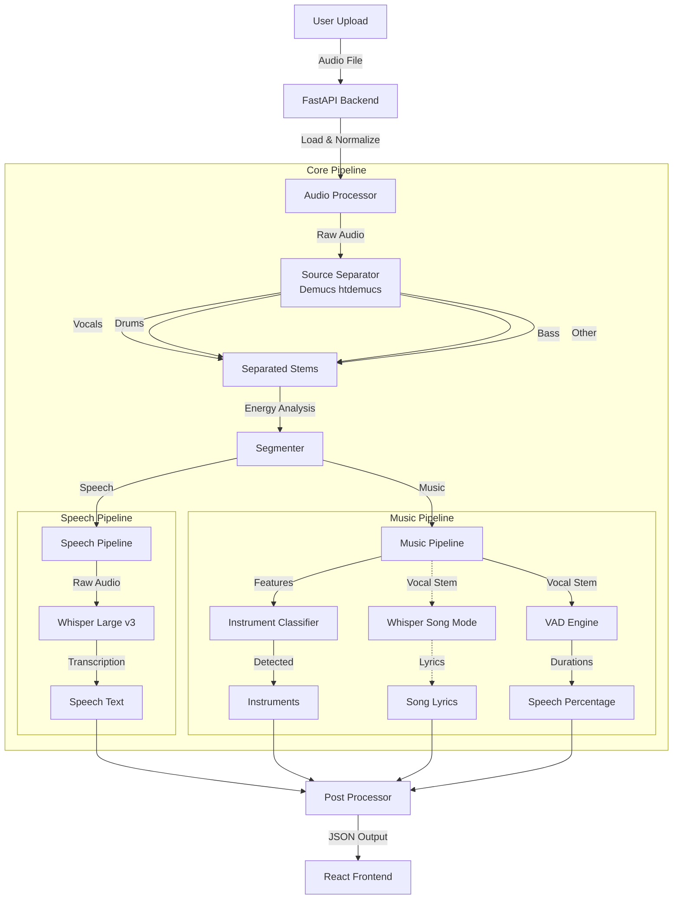

# Audio Intelligence - Advanced Audio Analysis Platform

**Build by an AI/ML Engineer | Harsh Gupta**

## 🎵 Overview

**Audio Intelligence** is a powerful, full-stack AI application designed to deconstruct, analyze, and understand audio files. It differentiates between speech and music, isolates stems (vocals, drums, bass, other), identifies specific instruments, and performs high-precision speech transcription—even within mixed music tracks ("Song Mode").

Powered by state-of-the-art Deep Learning models (**Demucs** and **Whisper**) and a modern React frontend, it provides a seamless visual dashboard for audio forensics and content creation.

---

## 🚀 Key Features

-   **Intelligent Segmentation**: Automatically detects and separates distinct segments of **Speech** and **Music**.
-   **Source Separation**: Splits music into 4 separate stems: **Vocals, Drums, Bass, and Other**, using high-fidelity separation.
-   **Instrument Identification**: Detects specific instruments in music tracks (e.g., Drums, Guitar, Piano, Cymbal) using spectral feature analysis.
-   **"Song Mode" Transcription**: Unlike standard transcribers, this system can extract and transcribe lyrics **directly from music tracks** by isolating the vocal stem before processing.
-   **Voice Activity Detection (VAD)**: Calculates accurate speech/vocal percentages by detecting actual vocal activity, ignoring instrumental breaks.
-   **Robust Audio Handling**: Supports various sample rates and formats (MP3, WAV, FLAC), with automatic resampling and stereo/mono conversion.
-   **Interactive Timeline**: Visualizes the audio structure with color-coded segments and confidence scores.

---

## 🧠 AI Models & Architecture

This project orchestrates multiple advanced models to achieve its results:

### 1. Source Separation: `Demucs (htdemucs)`
*   **Purpose**: To separate a mixed audio signal into its constituent sources (Vocals, Drums, Bass, Other).
*   **Why HtDemucs?**: "Hybrid Transformer Demucs" is currently SOTA (State of the Art) for music source separation, providing cleaner stems than previous ConvNet-based models.
*   **Implementation Detail**: The system internally upsamples audio to 44.1kHz and converts Mono to Stereo to match the model's training distribution, ensuring maximum accuracy.

### 2. Speech Recognition: `OpenAI Whisper (Large-v3)`
*   **Purpose**: To transcribe speech to text with near-human accuracy.
*   **Model**: `openai/whisper-large-v3`.
*   **Implementation Detail**: 
    *   For **Pure Speech**: Runs on the raw audio.
    *   For **Songs**: Runs on the *isolated vocal stem* extracted by Demucs. This creates a "Song Mode" that allows lyric transcription even in heavy rock or electronic mixes.

### 3. Instrument Classifier: `Spectral Heuristic Engine`
*   **Purpose**: To identify dominant instruments in music segments.
*   **Technique**: Uses a combination of:
    *   **MFCCs (Mel-frequency cepstral coefficients)** implies timbre.
    *   **Spectral Centroid** implies "brightness".
    *   **Zero Crossing Rate (ZCR)** detects percussive/noisy elements.
    *   **Custom Logic**: E.g., distinguish "Violin" from "Hi-Hats" by analyzing harmonic content vs noise density.

---

## 🏗️ Architecture Diagram



---

## 🛠️ Technology Stack

*   **Backend**: Python, FastAPI, Uvicorn, PyTorch, Librosa, Torchaudio.
*   **Frontend**: TypeScript, React, Vite, Tailwind CSS, Framer Motion, Lucide Icons.
*   **Compute**: CUDA-enabled GPU suggested (NVIDIA) for fast inference.

---

## 💻 Installation & Setup

### Prerequisites
*   **Python 3.10+**
*   **Node.js 18+ & npm**
*   **FFmpeg** (Must be installed and added to system PATH)
*   **NVIDIA GPU** (Optional but highly recommended for Whisper-Large and Demucs)

### 1. Backend Setup

1.  **Clone the repository**:
    ```bash
    git clone <repository_url>
    cd audio_intelligence_mvp
    ```

2.  **Create a Virtual Environment**:
    ```bash
    python -m venv venv
    # Windows
    venv\Scripts\activate
    # Mac/Linux
    source venv/bin/activate
    ```

3.  **Install PyTorch (CUDA Version)**:
    *   *Note: Check [pytorch.org](https://pytorch.org/) for your specific command.*
    ```bash
    pip install torch torchvision torchaudio --index-url https://download.pytorch.org/whl/cu118
    ```

4.  **Install Dependencies**:
    ```bash
    pip install -r requirements.txt
    ```

5.  **Run the Server**:
    *   *First run will download ~5GB of models (Whisper Large + Demucs).*
    ```bash
    python main.py
    ```
    *   Server will start at `http://0.0.0.0:8000`.

### 2. Frontend Setup

1.  **Navigate to frontend**:
    ```bash
    cd frontend
    ```

2.  **Install Packages**:
    ```bash
    npm install
    ```

3.  **Start Development Server**:
    ```bash
    npm run dev
    ```
    *   Frontend will start at `http://localhost:5173`.

---

## 📝 Usage

1.  Open the frontend in your browser (`http://localhost:5173`).
2.  **Drag & Drop** an audio file (MP3, WAV) into the upload zone.
3.  The system will process the file (time depends on GPU/CPU):
    *   **Loading**: Audio preprocessing.
    *   **Separating**: Demucs extracts stems.
    *   **Segmenting**: Analyzes stems to classify Speech vs Music.
    *   **Transcribing/Classifying**: Runs Whisper or Instrument Detection.
4.  **View Results**:
    *   See the % of Music vs Speech.
    *   Read transcribed text/lyrics.
    *   See detected instruments with confidence scores.

---

## 📂 Project Structure

```
audio_intelligence_mvp/
├── main.py                 # FastAPI Entry point & Orchestrator
├── audio_processor.py      # Librosa loading & cleaning
├── source_separator.py     # Demucs wrapper (Stem separation)
├── segmenter.py            # Logic for Speech vs Music classification
├── speech_recognizer.py    # Whisper wrapper (Transcription)
├── instrument_classifier.py# Feature extraction & heuristics
├── post_processor.py       # Aggregates results
├── requirements.txt        # Python dependencies
└── frontend/               # React Application
    ├── src/
    │   ├── components/     # UI Components (ResultsDashboard, UploadZone)
    │   ├── services/       # API Integration
    │   └── App.tsx         # Main Frontend Entry
    └── ...
```

---

## ⚠️ Notes

*   **Performance**: Processing a 3-minute song takes ~20-30s on an RTX 3060. CPU-only execution will be significantly slower.
*   **Accuracy**: "Song Mode" relies on the distinct separation of vocals. Extremely muddy or lo-fi mixes may have lower transcription accuracy.
*   **Storage**: The models are cached locally. Ensure you have ~5-6GB of disk space.

---

**Audio Intelligence MVP**
